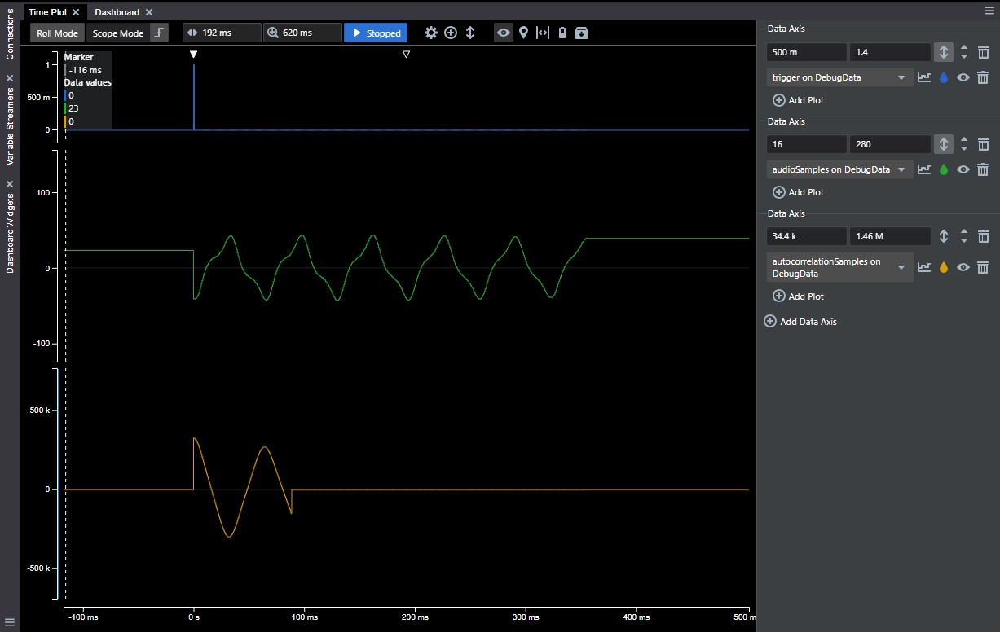

<!-- Please do not change this html logo with link -->

# PIC18F16Q40 Guitar Tuner

## Introduction
This project highlights the advanced core independent peripherals found on the PIC18-Q40 family of MCUs to create a guitar tuner. This project uses the 12-bit Analog to Digital Converter with Computation (ADCC) module to interface an analog microphone sensor which was used to measure sound. The Direct Memory Access (DMA) module was used to transfer the ADCC result to memory core independently without any CPU intervention. The Serial Peripheral Interface (SPI) and Pulse Width Modulator (PWM) peripherals were used to drive an LCD display to show the musical note output in real time. The Universal Asynchronous Receiver Transmitter (UART) peripheral was used to show debugging data in MPLAB Data Visualizer.  

## Software Used
  - [MPLAB® X IDE 6.25 or newer](http://www.microchip.com/mplab/mplab-x-ide)
  - [MPLAB® XC8 3.0 or a newer compiler](http://www.microchip.com/mplab/compilers)
  - [MPLAB® Code Configurator (MCC) 5.7.1 or newer](https://www.microchip.com/mplab/mplab-code-configurator)
  - [Microchip PIC18F-Q Series Device Support (PIC18-Q_DFP 1.28.451) or newer](https://packs.download.microchip.com/)

## Hardware Used
  - [PIC18F16Q40 Microcontroller](https://www.microchip.com/wwwproducts/en/PIC18F16Q40)
  - [Curiosity Low Pin Count (LPC) Development Board Rev4](https://www.microchip.com/DevelopmentTools/ProductDetails/DM164137)     
  - [MikroElektronika MIC Click Board](https://www.mikroe.com/mic-click)
  - [MikroElektronika LCD Mini Click Board](https://www.mikroe.com/lcd-mini-click)  

## Demo Configuration
The Curiosity Low Pin Count (LPC) Development Board was selected as the development platform for this code example. The guitar tuner display was implemented using the MikroElektronika LCD Mini Click Board and the MikroElektronika Mic Click Board was used for converting sound to appropriate analog voltages. The Curiosity LPC Development Board only has one MikroBUS socket which was used for the LCD display, so the Mic Click Board was connected using a breadboard and jumper wires. The jumper wire connections needed to connect the microphone on the breadboard to the PIC18F16Q40 on the Curiosity LPC Development Board are as follows:

- Green wire: Connection between the analog output of the Mic Click Board to the corresponding positive ADC channel on the PIC microcontroller.

- Red / black wires: 3.3V and Ground from the Curiosity LPC Development Board to the breadboard where the microphone audio sensor is placed.

- Yellow Wire: Connect from UART TX pin (RC4) of the PIC18F16Q40 to the TX connection on the Curiosity LPC Virtual COM port for serial communication.

The following table summarizes the signal connections used in this code example:

|Signal                      | Microcontroller Pin    |
|----------------------------| :--------------------: |
|UART TX	                   | RC4                    |
|LCD Mini Click – SDO (SPI)	 | RB4                    |
|LCD Mini Click – SDI (SPI)  | RC7                    |
|LCD Mini Click – SCK (SPI)  | RB6                    |
|LCD Mini Click – CS (SPI)   | RC6                    |
|LCD Mini Click – CS2 (SPI)  | RC2                    |
|LCD Mini Click – RST	       | RA4                    |
|LCD Mini Click – PWM	       | RC5                    |
|MIC Click Output            | RB7                    |

### MCC Pin Manager Window View:
</a>

### Curiosity LPC Project Setup:
</a>

## Frequency Measurement Algorithm 
To measure the frequency of a guitar audio signal, an autocorrelation algorithm was used. Autocorrelation is necessary because the harmonics present in a guitar signal can make simpler algorithms such as measuring the zero-crossing of the signal inaccurate.  

Autocorrelation is the correlation of a signal with delayed copy of itself. Applying autocorrelation on a discrete-time signal with a particular delay value will produce a number that indicates how similar the signal is to itself at that delay. The autocorrelation function is performed by multiplying each sample of the original signal with the delayed version of the signal and summing the results. The function used for this application is shown below where d represents the time delay, N represents the total number of samples, and n is the index of the original signal. 

</a>

By applying this function for a range of time delays, a new autocorrelation signal is produced that will have peaks at the points where the signal is periodic. To determine the frequency of the original signal, the highest peak of the autocorrelation signal is found. The index of the highest peak in the autocorrelation signal represents the time delay where the signal is most periodic. Taking the inverse of this time delay value results in the frequency. In this application, the frequencies are precomputed and stored in a table to make the algorithm faster. The accuracy of this method is limited by the sample rate of the original signal. 

## ADCC 
The ADCC module was used in this code example to measure the analog output of the microphone audio sensor. Timer0 was used as the ADC's auto-conversion trigger source, allowing samples to be captured at a steady rate of 8.9 kHz. Although the ADC has 12-bit resolution, only the upper 8 bits of result are used for the sake of increasing the speed of the autocorrelation calculations. The MCC settings for the ADC are shown below:

### ADCC MCC Settings:

| ADC Setting                    |    Value     |
|--------------------------------|-------------:|
| TMR Dependency Selector        |  TMR0        |
| Enable ADC                     |  Enabled     | 
| Result Alignment               |  Left        |
| Positive Input Channel         |  ANB7        |
| Positive Voltage Reference     |  Vdd         |
| Negative Voltage Reference     |  Vss         | 
| Auto-Conversion Trigger Source |  TMR0        | 
| Clock Source                   |  FOSC        | 
| Clock Divider                  |  FOSC/64     | 

## DMA 
The DMA module was used in this code example to automatically transfer the ADC conversion results to data memory while the autocorrelation is being calculated. The DMA was configured to transfer the upper byte of the ADC conversion result every time an ADC conversion is finished. The DMA was set to automatically increment it's destination pointer to fill an array of 512 bytes in user memory. The MCC settings for the DMA are shown below: 

### DMA MCC Settings

|   DMA Setting                  |    Value      |
|--------------------------------|--------------:|
| DMA Enable                     |  Disabled     |
| DMA Instance Select            |  0            | 
| Start Trigger Enable           |  Disabled     | 
| Abort Trigger                  |  DMA1DCNT     | 
| Abort Trigger Enable           |  Disabled     | 
| Source Region                  |  SFR          | 
| Source Module                  |  ADCC         | 
| Source SFR                     |  ADRESH       |
| Source Mode                    | unchanged     | 
| Source Message Size            |  1            | 
| Destination Region             | GPR           | 
| Destination Size               | 0             | 
| Destination Mode               | incremented   | 
| Destination Message Size       | 512           | 

## Timer0 
The TMR0 module was used in this code example to trigger the ADCC to perform conversions at a specific rate. The timer period is set to 112 us to generate a sampling frequency of 8900 Hz. The MCC settings for TMR0 are shown below:

### TMR0 MCC Settings

|        TMR0 Settings           |  Value        | 
|--------------------------------|--------------:|
| Timer Enable                   | Enabled       | 
| Clock Source                   | MFINTOSC      | 
| Synchronization Enable         | Disabled      |
| Prescaler                      |  1:1          |
| Postscaler                     |  1:1          | 
| Requested Period               |  112 us       | 
 

## SPI 
The SPI module was used to drive the LCD Mini Click Board. The LCD is driven by a I/O expander that communicates over SPI to save pins on the MCU. MCC was used to configure the SPI to run at 125 kHz in SPI Mode 0. 

## PWM
The PWM module was used in this code example to control the brightness of the LCD display backlight on LCD Mini Click Board. MCC was used to configure the PWM with a duty cycle of 70%. 

## UART
The UART module was used in this code example to optionally display debugging data using MPLAB Data Visualizer. To view the debugging data, the "DEBUG" configuration must be chosen in the MPLAB X project. MPLAB Data Visualizer can then be used to view the ADC samples along with the autocorrelation signal each time it is calculated. To view the data, open MPLAB Data Visualizer and load the file configuration file called "dataVisualizerConfig.dvws". The UART module was configured using MCC in Asynchronous 8-bit mode with a baud rate of 115200. The UART TX pin was selected as pin RC4 and connected to the TX pin of the Virtual COM port on the Curiosity LPC Development Board. The MCC settings for the UART are summarized below:

### UART MCC Settings

|    UART Setting                |   Value        |
|--------------------------------|---------------:|
|  Baud Rate                     |  115200        | 
|  Parity                        |  None          | 
|  Data Size                     |  8             |
|  Stop Bits                     |  1             | 
|  Flow Control Mode             |  None          | 
|  Redirectd STDIO to UART       |  Disabled      | 
|  Enable Receive                |  Disabled      | 
|  Enable Transmit               |  Enabled       | 
|  Auto-baud Detection           |  Disabled      | 
|  Enable UART                   |  Enabled       | 
 

An example of the Data Visualizer output is shown below:

### Data Visualizer Output
</a>

## Guitar Tuner LCD Mini Output Results:
</a>
