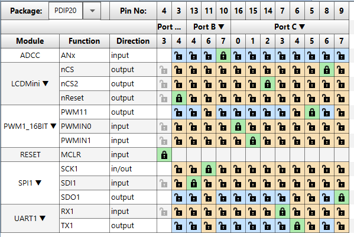
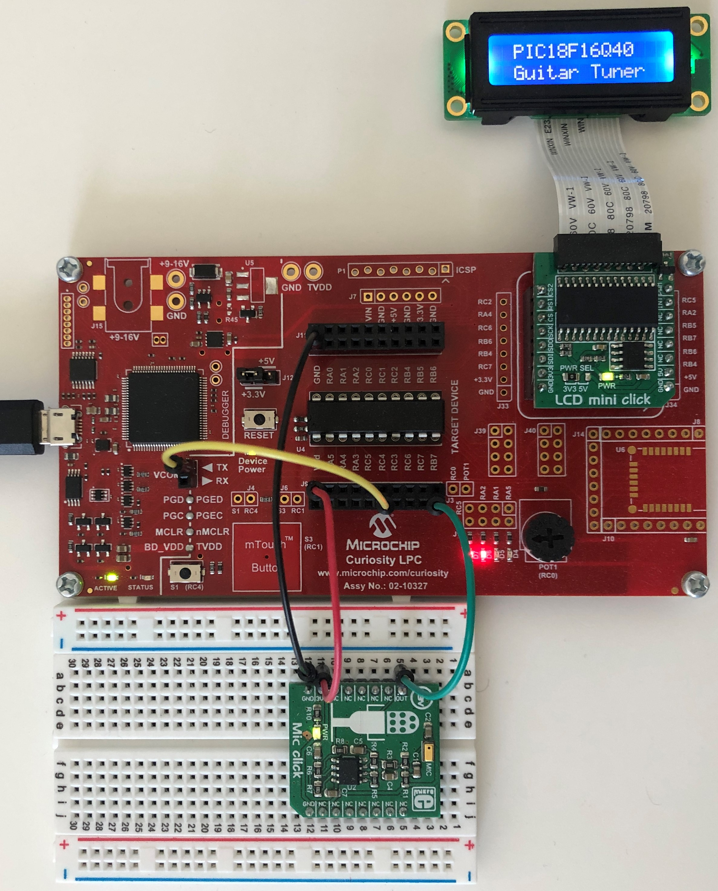
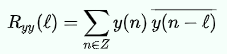
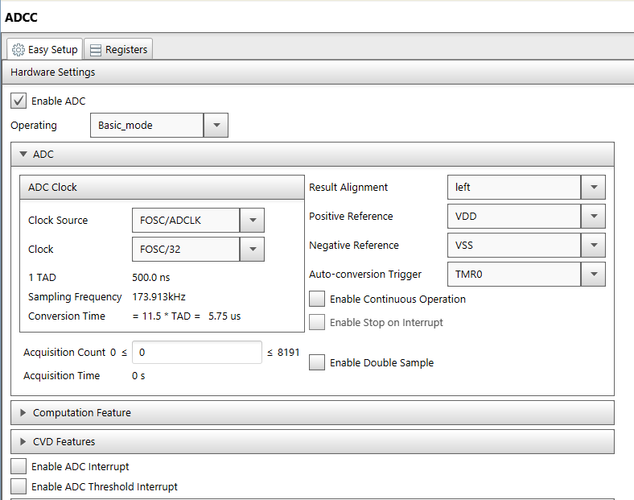
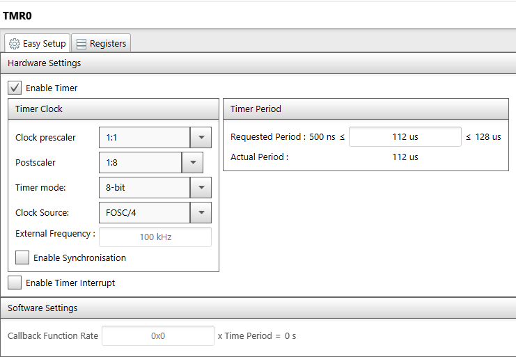
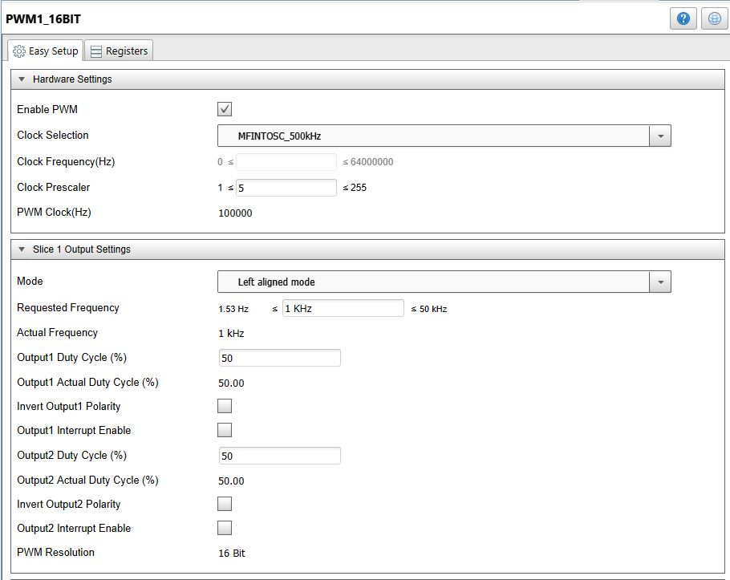
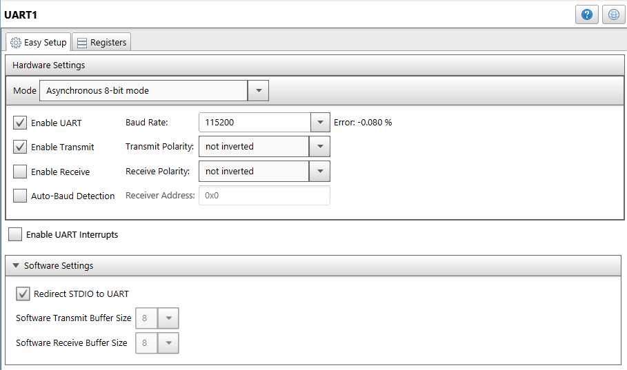
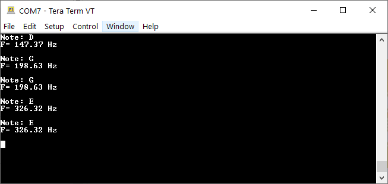

<!-- Please do not change this html logo with link -->
<a href="https://www.microchip.com" rel="nofollow"></a>

# OBJECTIVE:
The “pic18f16q40-guitar-tuner” project highlights the advanced core independent peripherals found on the PIC18-Q40 family of devices to create a PIC18 powered guitar tuner. This project implements the 12-bit Analog to Digital Converter with Computation (ADCC) module to interface an analog microphone sensor which was used to measure sound frequency. The Direct Memory Access (DMA) module was used to transfer the ADCC result to memory core independently without any CPU intervention. The SPI and PWM modules were used to drive an LCD display to show the musical note output in real time, and the UART module was used to also display the musical notes output over a serial port in real time.

## Software Used:
       - MPLAB® X IDE 5.40 or newer [(microchip.com/mplab/mplab-x-ide)](http://www.microchip.com/mplab/mplab-x-ide)
       - MPLAB® XC8 2.20 or a newer compiler [(microchip.com/mplab/compilers)](http://www.microchip.com/mplab/compilers)
       - MPLAB® Code Configurator (MCC) 3.95.0 or newer [(microchip.com/mplab/mplab-code-configurator)](https://www.microchip.com/mplab/mplab-code-configurator)
       - MPLAB® Code Configurator (MCC) Device Libraries PIC10 / PIC12 / PIC16 / PIC18 MCUs [(microchip.com/mplab/mplab-code-configurator)](https://www.microchip.com/mplab/mplab-code-configurator)
       - Microchip PIC18F-Q Series Device Support (1.5.124) or newer [(packs.download.microchip.com/)](https://packs.download.microchip.com/)

## Hardware Used:
         - [PIC18F16Q40 Microcontroller](https://www.microchip.com/wwwproducts/en/PIC18F16Q40)
         - [Curiosity Low Pin Count (LPC) Development Board Rev4](https://www.microchip.com/DevelopmentTools/ProductDetails/DM164137)     
         - [MikroElektronika MIC Click Board](https://www.mikroe.com/mic-click)
         - [MikroElektronika LCD Mini Click Board](https://www.mikroe.com/lcd-mini-click)  

## Demo Configuration
The Curiosity Low Pin Count (LPC) Development Board was selected as the development platform for this code example. The guitar tuner display was implemented using the MikroElektronika LCD Mini Click board (MIKROE-2453) and the MikroElektronika Mic Click Board (MIKROE-2563). The Curiosity LPC Development Board only has one MikroBUS socket which was used for the LCD display, so the Mic Click Board was connected using a breadboard and jumper wires. The jumper wire connections needed to connect the microphone on the breadboard to the PIC18F16Q40 on the Curiosity LPC Development Board are as follows:

- Green wire: Connection between the analog output of the Mic Click Board to the corresponding positive ADC channel on the PIC microcontroller.

- Red / black wires: 3.3V and Ground from the Curiosity LPC Development Board to the breadboard where the microphone audio sensor is placed.

Additionally, a jumper wire (yellow wire) was used to connect the UART TX pin (RC4) of the PIC18F16Q40 to the TX connection on the Curiosity LPC Virtual COM port for serial communication. The following table summarizes the signal connections used in this code example:

|Signal                      | Microcontroller Pin    |
|----------------------------| :--------------------: |
|UART TX	                   | RC4                    |
|LCD Mini Click – SDO (SPI)	 | RB4                    |
|LCD Mini Click – SDI (SPI)  | RC7                    |
|LCD Mini Click – SCK (SPI)  | RB6                    |
|LCD Mini Click – CS (SPI)   | RC6                    |
|LCD Mini Click – CS2 (SPI)  | RC2                    |
|LCD Mini Click – RST	       | RA4                    |
|LCD Mini Click – PWM	       | RC5                    |
|MIC Click Output            | RB7                    |

### MCC Pin Manager Window View:
</a>

### Curiosity LPC Project Setup:
</a>

## Autocorrelation
Before an analog signal can be stored and analyzed digitally, it must be converted to a digital signal which can be done in several steps. Based on the Nyquist-Shannon sampling theorem, the sampling frequency has to be at least double the maximum frequency present in the sampled signal. It is important that the sampling frequency is at least double the frequency of the signal being measured so that the specification of the signal will not change when it is in form of discrete data that will be stored in memory.

Autocorrelation is the correlation of a signal with delayed copy of itself as a function of delay. It is the similarity between observations as a function of the time lag between them. Autocorrelation of discrete-time signals was used in this code example to find the number of periodic repetitions of the main signal in the gathered data. The equation below shows the discrete autocorrelation R at lag l for a discrete-time signal.

</a>

## ADCC Module Configuration
The ADCC module was used in this code example to measure the analog output of the microphone audio sensor. This peripheral was configured in Basic mode for this sensor interface, which allows the ADC to core independently perform conversions. Timer0 was used as a sampling timer for ADCC's auto-conversion trigger. The 12-bit ADC result is available in the ADRESL and ADRESH registers. The ADC conversion result was set to be left-aligned and the upper byte of the ADC conversion result was used as the input of the autocorrelation calculation. The MPLAB Code Configurator was used to quickly and easily setup the ADCC module for this sensor interface. The setup and configuration of the ADCC using MCC is shown in the figure below.

### ADCC Basic Mode MCC Configuration:
</a>

## DMA Module Configuration
The DMA module was used in this code example to automatically transfer the ADC conversion result value from the ADRES register to device memory core independently. In firmware, the DMA is triggered as soon as an ADC conversion is complete (ADIF trigger) and the content of the ADRESH register is transferred to an array variable previously defined in the memory. The DMA Destination Pointer (DPTR) is then incremented in hardware and points to the next address of the array elements. Since the Source Message Size (SSZ) bit is set to '1', the DMA stops after the first transfer and waits for the next trigger to occur. The DMA was configured so that this cycle happens 512 times, then the calculation will be applied to the gathered data and DMA will be ready for another set of data transfers.


## Timer Module Configuration
The TMR0 module was used in this code example to trigger the ADCC to perform conversions at a specific rate. The timer period is set to 112 uS to generate a sampling frequency of 8900 Hz. The figure below shows how the TMR0 module was configured in MCC.

### TMR0 MCC Configuration:
</a>

## LCDMini Library Configuration:
The LCDMini Library in MCC was used to generate the initialization code and functional APIs needed to use the display. The library sets up the SPI module with the correct configuration to ensure proper communication between the PIC microcontroller and the display driver, and also provides a set of functional APIs that make getting started with the display quick and easy. To add the LCDMini Library to an MPLABX project, open MCC and navigate to the "Device Resources" section. Once inside the Device Resources section, select the “Mikro-E Clicks” drop down menu, select “Displays”, and then add in the "LCDMini" library. The functional APIs provided by the LCD Mini library in MCC handle all of the SPI communication between the PIC and the display driver. The SPI module was used in this code example to communicate with the LCD display to show the real-time frequency of the musical note that is being played.

## PWM Module Configuration:
The PWM module was used in this code example to control the brightness of the LCD display backlight on LCD Mini Click board. The duty cycle of the PWM output signal is set to 70%. The following code snippet shows how to change the PWM output signal duty cycle using the APIs provided by MCC:
```c
PWM1_16BIT_SetSlice1Output1DutyCycleRegister(70);   // Setting LCD Brightness to 70%
PWM1_16BIT_LoadBufferRegisters();
```

### PWM MCC Configuration:
</a>


## UART Module Configuration:
The UART module was used in this code example as an alternative way of displaying the guitar tuner output results by printing the musical note symbol that is being played and the frequency of that note using a serial port. The UART module was configured using MCC in Asynchronous 8-bit mode with a baud rate of 115200. Only transmission was enabled, and the “Redirect STDIO to UART” checkbox was selected under the software settings tab to include the library needed for “printf” functions. The UART TX pin was selected as pin RC4 and connected to the TX pin of the Virtual COM port on the Curiosity LPC Development Board (yellow wire).

### UART MCC Configuration:
</a>


## Guitar Tuner Serial Port Output Results:
</a>

## Guitar Tuner LCD Mini Output Results:
</a>
